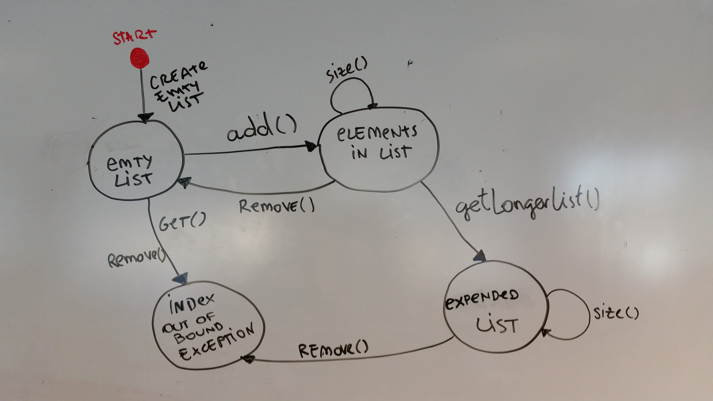
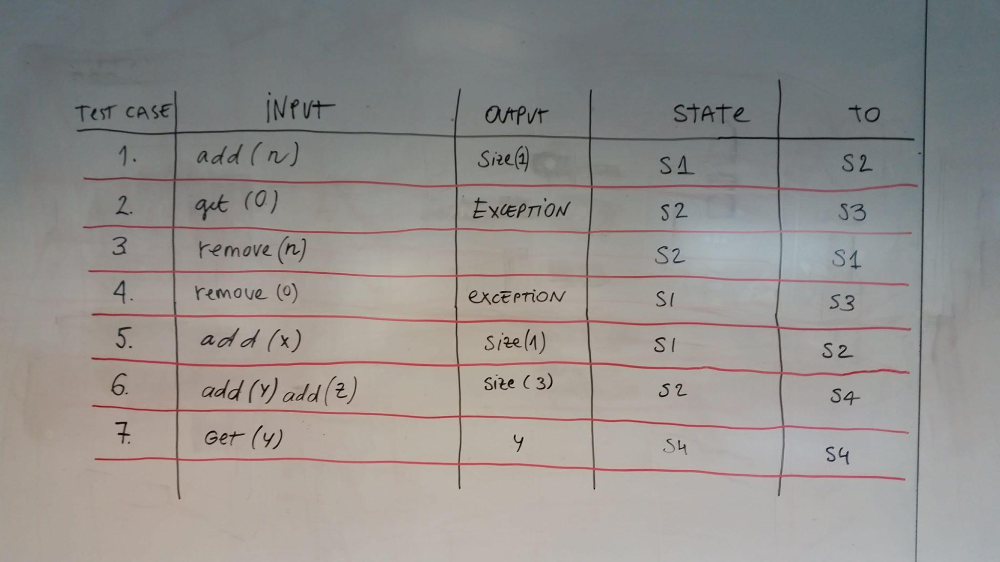

### TestCaseExercises

#Equivalence classes
1. Make equivalences classes for the input variable for this method: public boolean isEven(int n)

If the provided input is even, the result will be True.
If the provided input is uneven, the result will be False.

2. The valid range is $1000 pr. month to $75,000 pr. month

| EQUIVALENCE CLASSES	| TEST CASE(isEven) |
|---|---|
| salary < 1000 | invalid |
| salary > 75.000 |	invalid |
| salary >= 1000 |	valid |
| 1000 =< 75.000 |	valid |

3.Make equivalences classes for the input variables for this method: public static int getNumDaysinMonth(int month, int year)

| EQUIVALENCE CLASSES	| TEST CASE(int month, int year) |
|---|---|
| month < 1 |	invalid |
| month > 12 | invalid |
| 1 < month < 12 | valid |

Int year has to be a number of Integer type above 0, not Double.

#Boundary Analysis

1.Do boundary value analysis for input values exercise 1

Boundary value analysis is not possible to be used where there is no range for both even and odd numbers.

2.Do boundary value analysis for input values exercise 2
         999|1000            74.999|75.001
------------|-----------------------|-------------

       1000                 75.000            values
       
If the value is less than 1000, it is invalid.
If the value is in the range of over 1000 and  under 75.000, it is valid.
If the value is above 75.000, it is invalid.

3.Do boundary value analysis for input values exercise 3
         0|2                     11|13
------------|-----------------------|-------------

       1                 12                   months
       
If the value for month is less than 1, it is invalid.
If the value is in the range between 1 and 12, it is valid.
If the value is over 12, it is invalid.

No set range for years.

#Decision tables

1.Decision table for the business case.

|CONDITION| | | |	|			
|---|---|---|---|---|
|Hospital|T|T|F|F|
|Doctor|T|F|T|F|
|**ACTION**	|	| | | |
|0%	|	| | |T|
|50%| | |T| |
|80%|T|T| | |

2.Decision table for leap years.

|CONDITION| | | | | | | | |
|---|---|---|---|---|---|---|---|---|
|Leap year|T|T|T|F|F|F|T|F|
|/ 100|T|T|F|T|F|F|F|T|
|/ 400|T|F|F|T|F|T|T|F|
|**ACTION**	| | | | | | | | |
|Leap year|T|T|T|F|F|F|T|F|

#State transition

1.State diagram depicting the states of MyArrayListWithBugs.java

2.Test cases from the state diagram

- S1 - empty list
- S2 - elements in list
- S3 - index out of bound
- S4 - expanded list

3.

4.

5.Consider whether a state table is more useful design technique.

A state table helps a lot with tracking and observing the program in its entirety.
It produces a clear overview and, therefore, a clear approach to test cases.

6.Make a conclusion where you specify the level of test coverage and argue for your chosen level:

 - Percentage of states visited: 100% percent of states are visited.
 - Percentage of transitions exercised:
